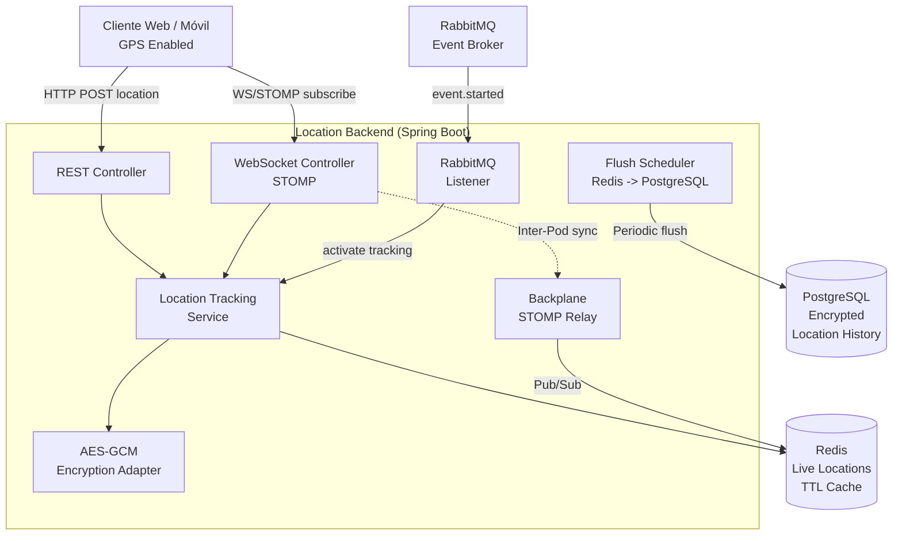
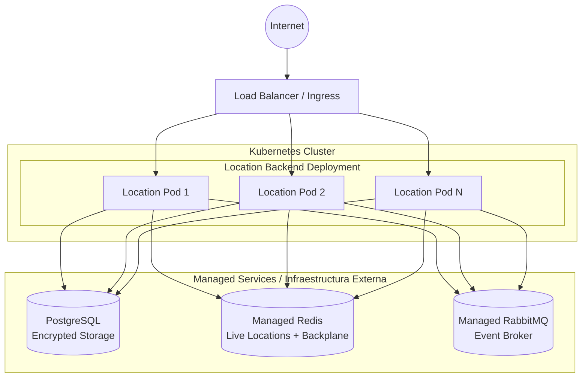

# Location Backend Microservice

Este microservicio es responsable del rastreo de ubicación en tiempo real de los participantes durante eventos de la plataforma U-Link. Almacena ubicaciones cifradas legalmente, proporciona flujos en tiempo real vía WebSockets, y gestiona tanto ubicaciones en vivo como rutinas históricas. Forma parte del ecosistema **PATRICIA**.

## ¿Qué hace el microservicio?

1. **Rastreo de Ubicación en Tiempo Real:** Utiliza WebSockets (STOMP) para transmitir posiciones GPS de participantes en tiempo real durante eventos activos. Los datos se almacenan temporalmente en Redis con TTL configurable (5 minutos para ubicaciones en vivo).
2. **Sincronización Multi-nodo (Backplane):** Implementa un patrón de *Backplane* usando Redis Pub/Sub para sincronizar flujos de ubicación entre múltiples instancias del servicio, permitiendo la escalabilidad horizontal.
3. **Cifrado de Datos Sensibles:** Cifra las coordenadas GPS utilizando AES-256-GCM antes de persistirlas en PostgreSQL, cumpliendo con requisitos de protección de datos personales y privacidad.
4. **Gestión de Historial:** Diferencia entre ubicaciones en vivo (TTL corto, 5 min) y ubicaciones rutinarias (TTL largo, 12h). Un scheduler periódico (`FlushScheduler`) consolida datos de Redis a PostgreSQL cada 15 minutos.
5. **Integración Orientada a Eventos:** Escucha eventos de dominio a través de RabbitMQ (AMQP), como el inicio y fin de eventos, para activar/desactivar el rastreo de ubicación de los participantes.

---

## Parámetros de Calidad y Principios de Diseño

* **Arquitectura Hexagonal (Puertos y Adaptadores):** El dominio está desacoplado de la infraestructura mediante puertos y adaptadores. El cifrado AES-GCM está implementado como un adaptador (`AesGcmEncryptionAdapter`).
* **Principios SOLID:**
  * *Single Responsibility Principle (SRP):* Separación clara entre controladores REST (`LocationController`), WebSockets (`LocationStompController`), lógica de negocio (`LocationTrackingService`), cifrado (`AesGcmEncryptionAdapter`), y backplane (`BackplaneStompRelay`).
  * *Dependency Inversion Principle (DIP):* Inyección de dependencias a través de constructores inyectados.
* **Alta Disponibilidad y Escalabilidad Horizontal:** Redis maneja el estado efímero de ubicaciones en vivo, PostgreSQL persiste el historial, y el backplane sincroniza entre pods.
* **Tolerancia a Fallos:** *Health Probes* (liveness, readiness) a través de Spring Boot Actuator.
* **Testing y Code Coverage:** *Coverage Gate* con JaCoCo (mínimo 80% en líneas), con tests de integración usando Testcontainers.

---

## Diagrama de Arquitectura



---

## Diagrama de Despliegue



## Tecnologías Principales

* Java 21
* Spring Boot 3.5.15
* Spring Web, Spring WebSockets
* Spring Data JPA (PostgreSQL)
* Spring Data Redis (Live Locations + Backplane)
* Spring AMQP (RabbitMQ)
* AES-256-GCM Encryption (Legal Compliance)
* Flyway (Migrations)
* Spring Boot Actuator
* Springdoc OpenAPI 2.8.16
* Testcontainers (Integration Tests)
* JaCoCo (Coverage)

## API Documentation

The service exposes a RESTful API documented via OpenAPI. Once the application is running, you can explore the API using the Swagger UI available at:
```
http://<HOST>:<PORT>/swagger-ui.html
```
The OpenAPI specification is generated automatically by Springdoc and can be accessed at `/v3/api-docs`.

## Running Locally

### Prerequisites
- Java 21 (or newer)
- Maven 3.9+
- Docker (optional, for containerized execution)
- Access to a PostgreSQL instance (local or remote)
- Access to a Redis instance (local or remote)
- Access to a RabbitMQ broker (local or remote)

### Steps
1. Clone the repository and navigate to the project root.
2. Set the required environment variables (see *Configuration* section below).
3. Build the project:
   ```
   ./mvnw clean package
   ```
4. Run the application:
   ```
   java -jar target/location-0.0.1-SNAPSHOT.jar
   ```
   The service will start on port **8089** by default.

## Docker Deployment

A Dockerfile is provided for containerizing the microservice. Build and run the image with:
```bash
docker build -t location-backend:latest .

docker run -d \
  -p 8089:8089 \
  -e "SPRING_PROFILES_ACTIVE=prod" \
  -e "SPRING_DATASOURCE_URL=jdbc:postgresql://postgres:5434/location" \
  -e "SPRING_REDIS_HOST=redis" \
  -e "SPRING_RABBITMQ_HOST=rabbitmq" \
  -e "JWT_SECRET=your-secret-key" \
  -e "AES_ENCRYPTION_KEY=your-32-byte-key" \
  location-backend:latest
```

A `docker-compose.yml` is also provided for local development with PostgreSQL, Redis, and RabbitMQ:
```bash
docker-compose up -d
```

## Configuration

The service requires the following environment variables:

| Variable | Description | Required |
|----------|-------------|----------|
| `JWT_SECRET` | Secret key for JWT validation | Yes |
| `SPRING_DATASOURCE_URL` | PostgreSQL JDBC URL | Yes |
| `SPRING_DATASOURCE_USERNAME` | PostgreSQL username | Yes |
| `SPRING_DATASOURCE_PASSWORD` | PostgreSQL password | Yes |
| `SPRING_REDIS_HOST` | Redis host for live locations and backplane | Yes |
| `SPRING_RABBITMQ_HOST` | RabbitMQ host for domain events | Yes |
| `SPRING_RABBITMQ_USERNAME` | RabbitMQ username | Yes |
| `SPRING_RABBITMQ_PASSWORD` | RabbitMQ password | Yes |
| `AES_ENCRYPTION_KEY` | 32-byte key for AES-256-GCM encryption | Yes |
| `BACKPLANE_ENABLED` | Enable Redis backplane for multi-pod sync | No (default: false) |
| `LIVE_TTL_SECONDS` | TTL for live location snapshots (default: 300) | No |
| `ROUTINE_TTL_HOURS` | TTL for routine location data (default: 12) | No |
| `FLUSH_CADENCE_MS` | Interval for Redis-to-PostgreSQL flush (default: 900000) | No |

## Testing

Unit and integration tests are located under `src/test/java`. Run the full test suite with:
```bash
./mvnw verify
```
Coverage is enforced by JaCoCo with a minimum of **80%** line coverage. Integration tests use Testcontainers for PostgreSQL and Redis.

## Contributing

Contributions are welcome! Please follow these steps:
1. Fork the repository.
2. Create a feature branch (`git checkout -b feature/awesome-feature`).
3. Implement your changes, ensuring existing tests pass and adding new tests if needed.
4. Submit a Pull Request with a clear description of the changes.

All contributions must adhere to the project's coding standards and pass the CI pipeline.

## License

This project is licensed under the **Apache License 2.0**. See the `LICENSE` file for details.
